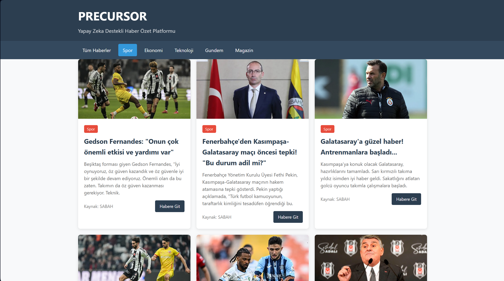

# Precursor - Haber Özet Platformu

Bu proje, çeşitli haber kaynaklarından RSS feed'leri aracılığıyla haberleri çeken, doğal dil işleme teknolojileri kullanarak özetleyen ve kategorilere göre sınıflandıran bir web uygulamasıdır.



## Özellikler

- RSS feed'lerinden otomatik haber toplama
- Transformers kütüphanesi ile haber özetleme
- Kategorilere göre haberleri filtreleme
- Responsive tasarım
- SQLite veritabanı ile haber depolama
- Arka planda otomatik haber güncelleme

## Gereksinimler

- Python 3.8+
- Flask
- Transformers
- PyTorch
- Feedparser
- SQLite

## Kurulum ve Çalıştırma

### Standart Python Kurulumu

1. Projeyi klonlayın:
```
git clone https://github.com/Abdulkadirklc/precursor.git
cd precursor
```

2. Sanal ortam oluşturun ve aktifleştirin:
```
python -m venv venv
venv\Scripts\activate  # Windows için
source venv/bin/activate  # Linux/Mac için
```

3. Gerekli paketleri yükleyin:
```
pip install -r backend/requirements.txt
```

4. Uygulamayı çalıştırın:
```
cd backend
python app.py
```

### Anaconda Kurulumu

Anaconda kullanıcıları için otomatik kurulum ve çalıştırma betikleri eklenmiştir:

#### Windows için:
```
run_anaconda.bat
```

#### Linux/macOS için:
```
chmod +x run_anaconda.sh
./run_anaconda.sh
```

Bu betikler:
1. Gerekli conda ortamını oluşturur (eğer yoksa)
2. Gerekli paketleri yükler
3. LLM modeli seçmenize olanak tanır
4. Uygulamayı başlatır

Alternatif olarak, manuel kurulum için `anaconda_kurulum.md` dosyasındaki adımları izleyebilirsiniz.

## Çalıştırma

### Windows için:
```
cd backend
basla.bat
```

veya

```
cd backend
python app_anaconda.py
```

### Linux/macOS için:
```
cd backend
python app_anaconda.py
```

## Tarayıcıda Görüntüleme

Tarayıcınızda `http://localhost:5000` adresine giderek uygulamayı görüntüleyebilirsiniz.

## LLM Modeli Hakkında

Bu projede, haber özetleme için çeşitli LLM modelleri kullanılabilir:

### Varsayılan Model
Hugging Face'in Transformers kütüphanesinden `facebook/bart-base` modeli varsayılan olarak kullanılmaktadır. Bu model, haber metinlerini özetlemek için eğitilmiş daha hafif bir modeldir.

### Alternatif Modeller
- `sshleifer/distilbart-cnn-6-6` (daha hafif, distilled model)
- `t5-small` (daha hızlı, daha az doğru)
- `google/pegasus-xsum` (alternatif model)
- OpenAI API (GPT-3.5 veya GPT-4) - API anahtarı gerektirir

Daha fazla bilgi için `llm_modelleri.md` dosyasına bakabilirsiniz.

## RSS Feed'leri

Proje, Türkiye'deki popüler haber kaynaklarından RSS feed'lerini kullanmaktadır. RSS feed'lerini yönetmek için:

```
cd backend
python rss_yonetici.py help
```

Yeni RSS kaynakları eklemek için:

```
python rss_yonetici.py add <kategori> <url>
```

## Geliştirme

### Backend

Backend, Flask kullanılarak geliştirilmiştir. Ana dosyalar:
- `backend/app.py` - Standart uygulama
- `backend/app_anaconda.py` - Anaconda kullanıcıları için geliştirilmiş sürüm

### Frontend

Frontend, saf HTML, CSS ve JavaScript kullanılarak geliştirilmiştir. Dosyalar `frontend` klasöründe bulunmaktadır.

## Ekran Görüntüleri

Uygulamanın ekran görüntülerini eklemek için:

1. Ekran görüntüsünü alın
2. Görüntüyü `frontend/static/images` klasörüne kaydedin
3. README.md dosyasında aşağıdaki gibi referans verin:

```markdown

```
